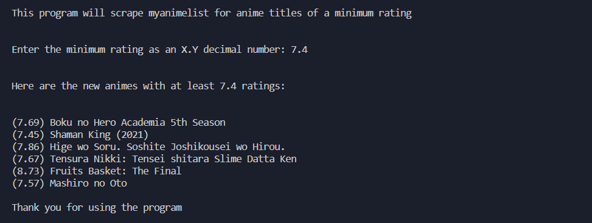

A python web scraping project with BeautifulSoup

Takes a decimal number in the form of X.Y to find all new anime titles this season with a rating of at least that much

The website I used for the data is <a href="https://myanimelist.net/">myanimelist</a>, <u>I do not own anything on that website</u>, the information released by the program is from their incredible website and credits to the creator.

The only thing I made myself are these files

<h2>Example usage</h2>

